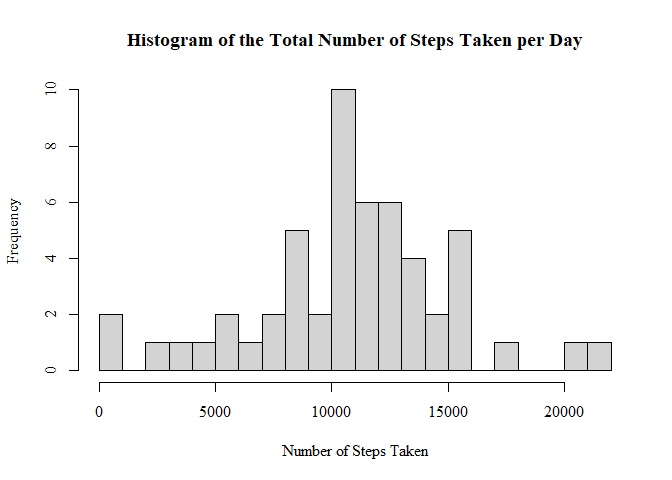
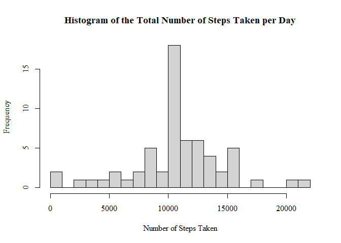
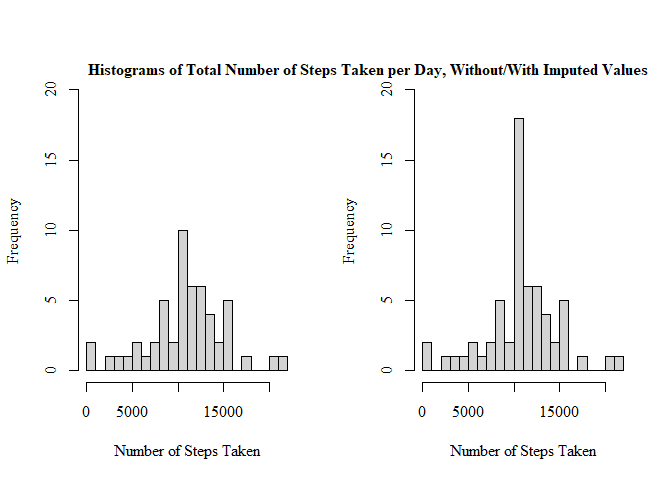
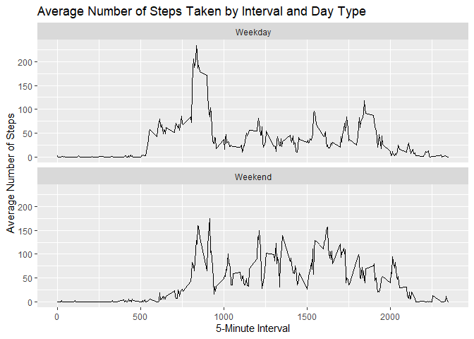

## Loading and preprocessing the data


```r
      setwd("c:/Users/Aeron/Desktop/Data Science/RepData_PeerAssessment1")
      download.file("https://d396qusza40orc.cloudfront.net/repdata%2Fdata%2Factivity.zip", destfile = "activity.zip")
      unzip("activity.zip", exdir = "c:/Users/Aeron/Desktop/Data Science/RepData_PeerAssessment1")
      activity <- read.csv("activity.csv", colClasses=c("numeric", "Date", "numeric"))
```

## What is mean total number of steps taken per day?


```r
    cleandata<-activity[!(is.na(activity$steps)), ]
    totalStepsDay <- aggregate(steps ~ date, cleandata, sum)
    # Create a histogram
   
    hist(totalStepsDay$steps, breaks=20, xlab="Number of Steps Taken", 
    main="Histogram of the Total Number of Steps Taken per Day", family="serif")
```

<!-- -->

```r
      # Calculate the mean and median
      mean_steps_per_day <- mean(totalStepsDay$steps)
      median_steps_per_day <- median(totalStepsDay$steps)
      
      # Print the mean and median
    cat("Mean of total number of steps per day:", mean_steps_per_day, "\n")
```

```
## Mean of total number of steps per day: 10766.19
```

```r
    cat("Median of total number of steps per day:", median_steps_per_day, "\n")
```

```
## Median of total number of steps per day: 10765
```

## What is the average daily activity pattern?


```r
      avg_steps_per_interval <- aggregate(steps ~ interval, data = activity, mean, na.rm = TRUE)
      
      plot(avg_steps_per_interval$interval, avg_steps_per_interval$steps, type = "l", xlab = "5-minute interval", ylab = "Average number of steps")
```

<!-- -->

```r
      max_interval <- avg_steps_per_interval$interval[which.max(avg_steps_per_interval$steps)]
      
      cat("The interval with the maximum average number of steps is", max_interval)
```

```
## The interval with the maximum average number of steps is 835
```

## Imputing missing values
Calculate and report the total number of missing values in the dataset (i.e. the total number of rows with NAs)

```r
      totalNA<-sum(rowSums(is.na(activity)) > 0)
      cat("The total number of missing values is", totalNA)
```

```
## The total number of missing values is 2304
```
## Creating new data set with imputed missing values.


```r
# Imputing NA
library(dplyr)
```

```
## 
## Attaching package: 'dplyr'
```

```
## The following objects are masked from 'package:stats':
## 
##     filter, lag
```

```
## The following objects are masked from 'package:base':
## 
##     intersect, setdiff, setequal, union
```

```r
imputed <- activity %>%
  group_by(interval) %>%
  mutate(steps_imputed = ifelse(is.na(steps), mean(steps, na.rm = TRUE), steps))
# Making histogram of Imputed Data
 
  totalStepsDayImputed <- aggregate(steps_imputed ~ date, imputed, sum)
  hist(totalStepsDayImputed$steps_imputed, breaks=20, xlab="Number of Steps Taken", 
  main="Histogram of the Total Number of Steps Taken per Day", family="serif")
```

<!-- -->

```r
# Calculate the mean and median
  impmean_steps_per_day <- mean(totalStepsDayImputed$steps_imputed)
  impmedian_steps_per_day <- median(totalStepsDayImputed$steps_imputed)
      
# Print the mean and median
  cat("Mean of total number of steps per day:", impmean_steps_per_day, "\n")
```

```
## Mean of total number of steps per day: 10766.19
```

```r
  cat("Median of total number of steps per day:", impmedian_steps_per_day, "\n")
```

```
## Median of total number of steps per day: 10766.19
```
## Comparison of Two Histogram:

```r
    par(mfrow = c(1, 2))
    hist(totalStepsDay$steps, breaks=20, xlab="Number of Steps Taken", family="serif", ylim=c(0,20), main=NULL)
    hist(totalStepsDayImputed$steps_imputed, breaks=20, xlab="Number of Steps Taken",family="serif", ylim=c(0,20), main=NULL)
    mtext("Histograms of Total Number of Steps Taken per Day, Without/With Imputed Values",adj=0.95, family="serif", font=2)
```

<!-- -->
The second histogram has a higher frequency than the first. This is due to the imputation of missing values.


## Are there differences in activity patterns between weekdays and weekends?


```r
# Creating new factor variables
library(dplyr)

    activity_Weekend <- activity %>%
    mutate( is_Weekend = ifelse(weekdays(date) %in% c("Saturday", "Sunday"), "Weekend", "Weekday"))
 
library(ggplot2)
library(dplyr)

    avg_steps <- activity_Weekend %>%
    group_by(interval, is_Weekend) %>%
    summarise(mean_steps = mean(steps, na.rm = TRUE))
```

```
## `summarise()` has grouped output by 'interval'. You can override using the
## `.groups` argument.
```

```r
    ggplot(avg_steps, aes(x = interval, y = mean_steps)) +
    geom_line() +
    facet_wrap(~is_Weekend, ncol = 1) +
    xlab("5-Minute Interval") +
    ylab("Average Number of Steps") +
    ggtitle("Average Number of Steps Taken by Interval and Day Type")
```

<!-- -->
